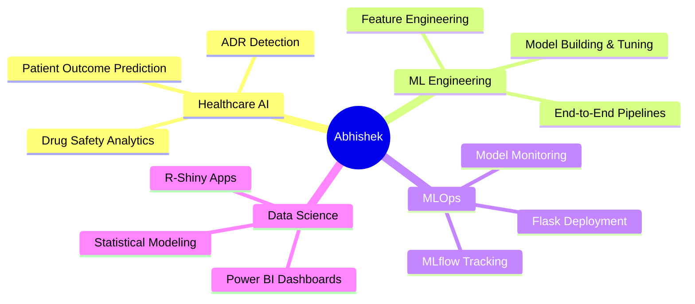

<div align="center">

<!-- Animated 3D Header Banner -->


<!-- Typing SVG Animation -->
<a href="https://git.io/typing-svg">
  
</a>

<br/>

<!-- Profile badges row -->
<p>
  
  &nbsp;
  
</p>

</div>

---

<!-- About Me Section with animated wave -->


### 👨‍💻 &nbsp;About Me

```python
class Abhishek:
    def __init__(self):
        self.name       = "Abhishek"
        self.role       = "Aspiring AI/ML Engineer"
        self.focus      = ["Healthcare AI", "Drug Safety", 
                           "Predictive Modeling"]
        self.currently  = "Building smarter ML pipelines 🚀"
        self.learning   = ["MLOps", "LLMs", "Deep Learning"]
        self.fun_fact   = "I find patterns where others see noise 🔍"
    
    def say_hi(self):
        print("Let's build something impactful together!")

me = Abhishek()
me.say_hi()
```

<br clear="right"/>

---

<!-- 3D Contribution Snake Animation -->
<div align="center">

### 🐍 &nbsp;My Contributions Eating Up the Grid

<picture>
  <source media="(prefers-color-scheme: dark)" srcset="https://raw.githubusercontent.com/ABHISHEkabiii/ABHISHEkabiii/output/github-snake-dark.svg" />
  <source media="(prefers-color-scheme: light)" srcset="https://raw.githubusercontent.com/ABHISHEkabiii/ABHISHEkabiii/output/github-snake.svg" />
  
</picture>

</div>

---

<!-- Skills Section -->
<div align="center">

### 🧠 &nbsp;Tech Arsenal

</div>

<table align="center">
<tr>
  <td valign="top" width="33%">

**🤖 AI / ML**


  </td>
  <td valign="top" width="33%">

**📊 Data & Visualization**


  </td>
  <td valign="top" width="33%">

**🗄️ Data Infra & Tools**


  </td>
</tr>
</table>

---

<!-- Animated Skill Bars via SVG -->
<div align="center">

### ⚡ &nbsp;Core Competency Radar

```
Machine Learning        ████████████████████░   90%
Data Analysis           ██████████████████░░░   85%
Deep Learning           ███████████████░░░░░░   75%
Data Visualization      ████████████████░░░░░   80%
MLOps / Deployment      ████████████░░░░░░░░░   60%
Healthcare AI / ADR     ██████████████████░░░   88%
```

</div>

---

<!-- GitHub Stats Section -->
<div align="center">

### 📊 &nbsp;GitHub Statistics


&nbsp;


<br/>
</div>

---

<!-- 3D Contribution Graph -->
<div align="center">

### 🌐 &nbsp;Activity Graph


</div>

---

<!-- Focus Areas -->
<div align="center">

### 🔬 &nbsp;What I'm Working On

</div>



---

<!-- Trophies -->

<!-- Quote -->
<div align="center">

### 💭 &nbsp;Dev Philosophy


</div>

---

<!-- Connect Section -->
<div align="center">

### 🌐 &nbsp;Let's Connect

<a href="https://www.linkedin.com/in/abhishek-199b22279/">
  
</a>
&nbsp;
<a href="mailto:abhishek720022002@gmail.com">
  
</a>
&nbsp;
<a href="https://instagram.com/_20_abhishek_02_">
  
</a>
&nbsp;
<a href="https://github.com/ABHISHEkabiii">
  
</a>

<br/>
<br/>

<!-- Footer wave animation -->


</div>

</details>
